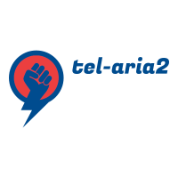
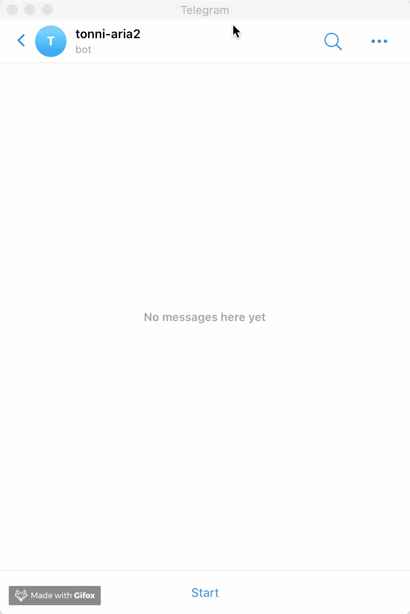
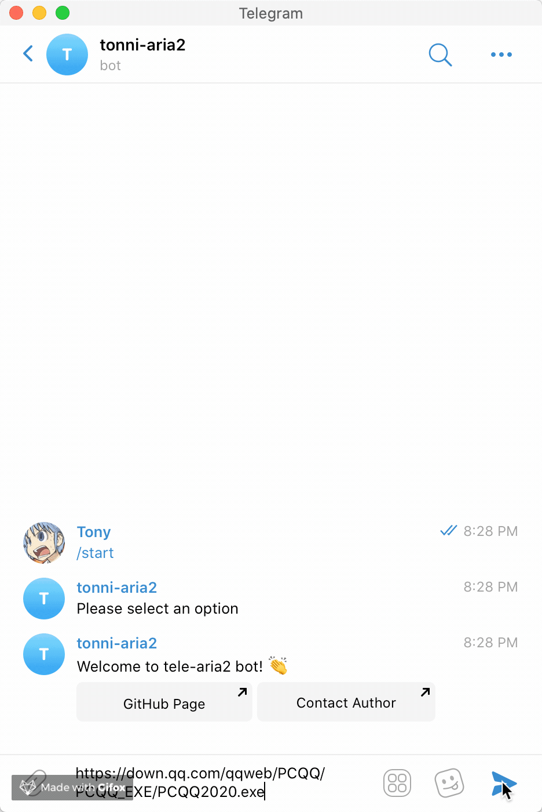

# Tele-aria2



[![TypeScript Style Guide][gts-image]][gts-url]

The newly rewritten project has a few advantages over the old:

1. Fully touch based, more easy to use, no command required to use this bot.
2. Real time notification, it's now using Aria2's Websocket protocol to communicate.
3. Better cli interface and config file support.

## Setup

1. Create your own bot and get its access token by using [@BotFather](https://telegram.me/botfather).
1. Get your unique user ID - https://stackoverflow.com/a/32777943/4480674.
1. (Optional) For mainland China users, be sure to have a proxy server running.
1. `$ npm install tele-aria2 -g`.
1. `$ tele-aria2 --help` to see how to get started.

## Configuration example

```json
{
  "aria2Server": "ws://192.168.1.154:6800/jsonrpc",
  "aria2Key": "xxx",
  "proxy": "socks://127.0.0.1:7891",
  "tgBot": "123456789:xxx",
  "tgUser": 123456
}
```

## Usage

Once your bot is up and running, go back to Telegram and click **Start**:



As you can see, all the action menus are instantly available to use, no command required!

### How can I add a new task?

It's really simple, you just send any HTTP/FTP/SFTP/Magnet url to chat, it will recognize and add it to Aria2 server!



**But I want to download from a torrent file**

No worries, just send your torrent file to chat!

## TODO

- [ ] Docker image
- [ ] Unit testing

[gts-image]: https://img.shields.io/badge/code%20style-google-blueviolet.svg
[gts-url]: https://github.com/google/gts
